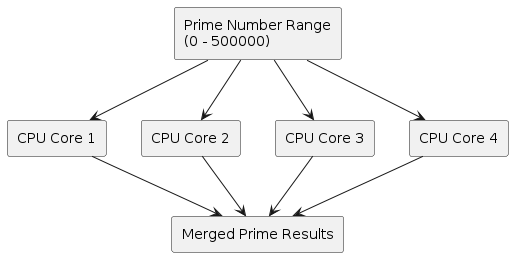

# Implementation

## System Architecture

The prime number search range is divided into several chunks based on the number of available CPU cores.

Each chunk is processed independently by a separate process using Python Multiprocessing.

The results from all processes are merged after execution to obtain the total number of prime numbers found within the specified range.

This workload distribution enables multiple CPU cores to work simultaneously, reducing execution time compared to the sequential implementation.

## Multiprocessing Strategy

The program automatically detects the number of available CPU cores and divides the search range equally among them.

Each process performs prime number checking on its assigned range and returns the results to the main process for aggregation.

## Performance Measurement

Execution time is measured for both sequential and parallel implementations.

The resulting execution times are compared to calculate the speedup achieved through parallel processing.