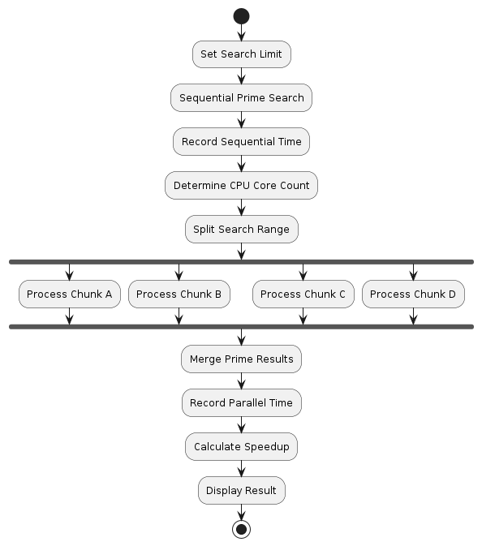

# Methodology

## Experimental Procedure

The experiment was conducted using two different approaches to search for prime numbers within a specified range.

### Sequential Execution

The sequential implementation checks each number one by one using a single process.

### Parallel Execution

The parallel implementation divides the search range into multiple chunks and distributes them across multiple CPU cores using Python Multiprocessing.

### Performance Measurement

The execution time of both approaches is measured and compared to evaluate the effectiveness of parallel processing.

### Speedup Calculation

The speedup value is calculated by dividing the sequential execution time by the parallel execution time.

## Flowchart

## Methodology Steps

1. Define the upper search limit.
2. Execute the Sequential Prime Number Search.
3. Measure Sequential Execution Time.
4. Determine the number of available CPU cores.
5. Divide the search range into multiple chunks.
6. Execute the Parallel Prime Number Search using Multiprocessing.
7. Measure Parallel Execution Time.
8. Calculate Speedup.
9. Compare the results.
10. Analyze the performance improvement.

## Expected Outcome

The parallel implementation is expected to reduce execution time by distributing workloads across multiple CPU cores and executing them simultaneously.