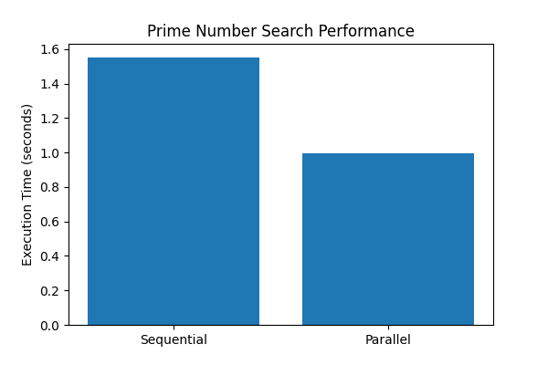

# Results

## Prime Numbers Found

The experiment successfully identified a total of **41,538 prime numbers** within the specified search range.

## Execution Time Comparison

| Method | Execution Time (seconds) |
|----------|----------|
| Sequential | 1.5537 |
| Parallel | 0.9973 |

## Performance Graph

## Speedup Calculation

Speedup is calculated using the following formula:

Speedup = Sequential Time / Parallel Time

Speedup = 1.5537 / 0.9973

Speedup = 1.56x

## Discussion

The experimental results show that the parallel implementation performed better than the sequential implementation.

By utilizing Python Multiprocessing, the workload was divided into multiple processes and executed simultaneously on multiple CPU cores.

As a result, the execution time decreased from **1.5537 seconds** to **0.9973 seconds**, achieving a speedup of **1.56x**.

Although the speedup is not perfectly proportional to the number of CPU cores, the result demonstrates that parallel processing can significantly improve computational efficiency for CPU-intensive tasks.

## Summary

- Total Prime Numbers Found: **41,538**
- Sequential Execution Time: **1.5537 seconds**
- Parallel Execution Time: **0.9973 seconds**
- Speedup Achieved: **1.56x**

The parallel implementation successfully reduced execution time and demonstrated the effectiveness of parallel computing using Python Multiprocessing.

---
[← Back to Home](index.md)